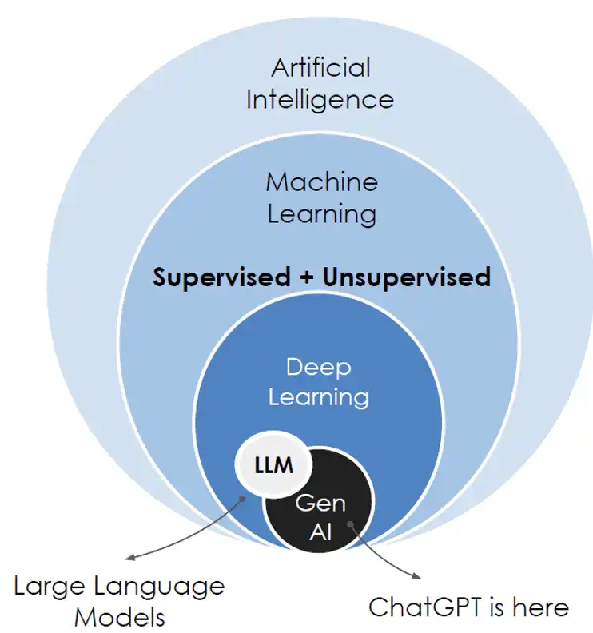

# IA DRAFT (WIP!)
{width=50%}

LLM = Sao especialistas em linguagens natural
Treinamento, Agentes, Agentic, Orquestração 
Inferencia = processo de execução onde um modelo analisa novos dados para gerar previsões, decisões ou respostas em tempo real. o output.
FMs = Sao multimodais e multiuso, modelos generalistas como Claude , Dall-e

Ollama, LLMStudio = Runtime local de LLMs 
MCP = Model Context Protocol (servidor que expõe tools/resources)
Metrica de avaliacao de modelos = Precisao, Relevancia, Coerencia, Latencia, Throughput
Parametros durante inferencia = Temperature, TopP, TopK, MaxLength

- Lista de favoritos que conheço sobre ia
- Roadmap de estudos que a certificação AWS pediu 
- Projeto caso de uso de rh/entrevistas poc na consultoria
- Ollama rodando local e escolhas de modelos para agentes (meetup)

## Roadmap que permite a certificação Amazon

- COLOCAR O RESUMO ESTUDADO, anotações do caderno? (fim do arquivo)
- 1 - Fundamentos de IA e ML: Explicar conceitos e terminologias básicos de IA / Identificar casos de uso práticos de IA / Descrever o ciclo de vida do desenvolvimento de ML
- 2 - Fundamentos de IA generativa: Explicar os conceitos básicos de IA generativa / Entender os recursos e as limitações de IA generativa para resolver problemas / Descrever a infraestrutura e as tecnologias da AWS para criar aplpicacoes de IA generativa
- 3 - Aplicações de modelos de base: Descrever as considerações sobre design de aplicações que usam modelos de base FMs / Escolher técnicas eficazes de engenharia de prompts / Descrever o processo de treinamento e ajuste fino dos FMs / Descrever os métodos para avaliar o desempenho do FM.
- 4 - Diretrizes de IA responsável: Explicar o desenvolvimento de sistemas de IA que são responsáveis / Reconhecer a importância de modelos transparentes e explicáveis.
- 5 - Segurança, conformidade e governança para soluções de IA: Explicar os métodos para proteger os sistemas de IA / Reconhecer os regulamentos de governança e conformidade de sistemas de IA.

## Sobre MCP
- Model Context Protocol = Servidor que expõe tools/resources para FMs
- Ollama nao consome MCP nativamente como Claude Desktop e VSCode Copilot 
- Analogia: Sem MCP -> IA, aqui esta um dump gigante de logs, tenta entender ai / Com MCP -> IA, voce pode chamar a função getCashBalance() e te devolvo respostas estruturadas (json)
{width=400}

### MCP como copiloto de arquitetura
- Expor ADRs (decisão de arquitetura), regras, padrões de modelos, contratos entre bundles e navegação	
- A IA passa a: Validar PR, alertar violações e sugerir refactores alinhados a governança (preditivo)
Passamos de: IA generica para IA especializada no sistema/parte. Copia e cola -> Dados vivos. Debug manual -> Debug assistido. Scripts isolados/distribuidos -> Protocolo padronizado -> Conhecimento individual/tribo -> Conhecimento codificado.

> NAO COLOCAR IA NO PRODUTO , COLOCAR IA NO PROCESSO DE ENGENHARIA

## Ideia de IA POC
- Projeto com foco, dentro outras features programáveis, em ser uma ferramenta da arquitetura com features usando ia para:
- Sumarizar ultimas alterações de um projeto 
- Resumir e descrever o que faz a versão xy de projeto 
- Baseado em leitura de release notes, changelogs e commits 
- Conseguir relacionar crashs e problemas com itens acima
- Encontrar brechas de segurança e bugs relacionados a libs usadas
- Gerar insights de bundles encontrando padrões observados nos últimos releases de bundles e libs

## Caso de uso: InterviewAI
- Projeto consultoria para apoio no processo de seleção de candidatos para vagas de tech.
- Dentre as features nao programáveis, estão Feedback estruturado com base na conversa ao-vivo. Extração de skills de descrição de vagas para contexto de conhecimento. Extração de hard e soft skills de cvs pdf. Resumo amigável e construtivo para pontos de melhoria com base em cruzamento vaga cv. Checagem de aderência individual, com justificativa. Checagem de aderência em lote, com justificativa individual. Pontuação de aderência. 
- Meetup dia 05/03, link do pitch em breve

### SLIDES

#### 1 - Introdução
Sobre o uso de Inteligência Artificial no nosso contexto atual.
Objetivo é entender os conceitos básicos e conhecer algumas formas e ferramentas aplicadas a devs, além de explorar oportunidades e desafios.

#### 2 - Como a IA funciona? 
A base: aprendizado de maquina (Machine Learning): “A capacidade da maquina aprender com dados, sem ser programada explicitamente para cada caso”
Tipos de aprendizados: 
- Supervisionado: Identifica padrões em dados rotulados (padrões de código a partir de exemplos)
- Nao supervisionado: Descobre padrões em dados nao rotulados (ex clustering de bugs, analise de logs)
- Reinforcement Learning: Aprende através de interações e feedback (ex otimização de pipelines de build)

Tabela de exemplos de abordagens de IA para devs:
Code Generation —> Gerar trechos de codigo
Debugging —> Identifica erros ou padrões suspeitos em códigos ou logs
Code refactoring —> Sugere ou automatização melhorias de código 
Code summarization —> Resume documentacao ou explica trechos complexos de código 
Testing —> Gera caso de testes, analisa cobertura e preve falhas 
Documentation —> Cria ou melhora documentação a partir de código
Code translation —> Traduz código de uma linguagem para outra
Compliance checking —> Verification se coding segue padrões ou estilo 
Project management —> Prioriza tarefas, estima prazos e outros com base em dados históricos

*Muitas dessas tarefas usam Linguagem Natural Processada (NLP) para entender e manipular código.
*Erros podem ser introduzidos, se dados ruins ou incompletos ou Modelo complexo demais ou Modelo simples demais (Overfitting e Underfitting)
*Pode haver viés nos dados de treinamento, levando a problemas éticos

#### 3 - Onde a IA pode ser usada hoje?
- Gerar código: Copilot, CodeWhisperer
- Analise Estatica de Codigo: SonarQube, CodeGuru
- Refactoraçao Inteligente: Eslint com IA
- Documentacao: Doxygen
- Geração de testes: Encontrar bugs de regressão, CodeBERT
- Analise de falhas e suporte: Ferramentas de analise de logs com IA, Splunk ML

#### 4 - Considerações finais
Perspectiva geral ( a ia nao substituirá os devs, mas os amplificará ) … 
É uma ferramenta, com limitações e necessidade de supervisão humana.
Desafios e tendencias: Etica e segurança, Usabilidade, Interpretabilidade, Ferramentas mais integradas
Conclusão: “Pensamento sistêmico não pode ser delegado, código sim”

### LINKS UTEIS E ESTUDOS
- https://github.com/thiagosalper/ai-links-dump 
- Projeto e Presentation InterviewAI: [link]
- MCP Example com SDK: https://github.com/thiagosalper/mcp-server-interview-ai 
- Skills Agents com Ollama: …
- Roadmap RepoGraph: …
